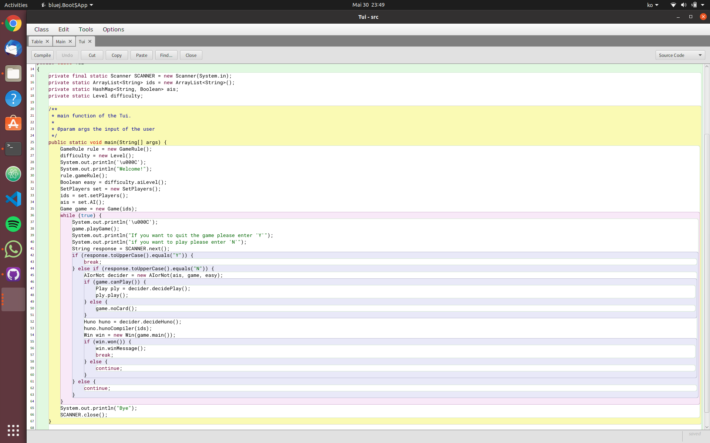
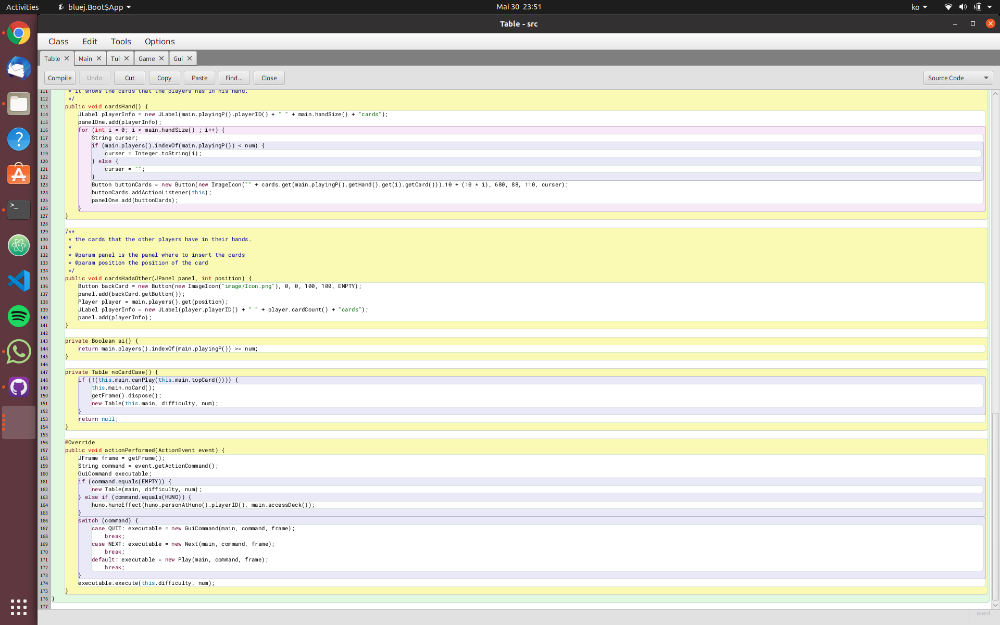
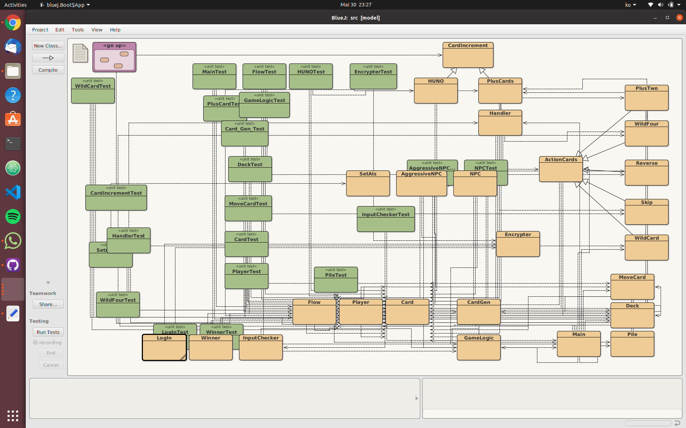
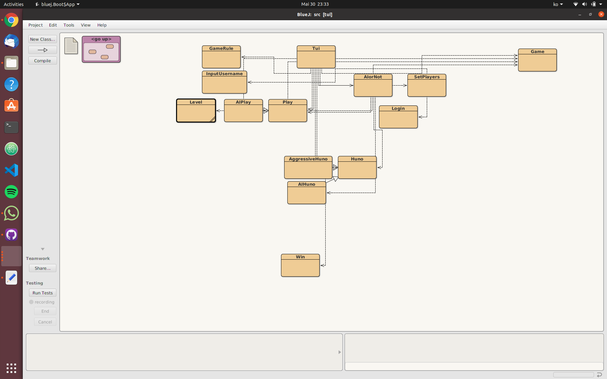
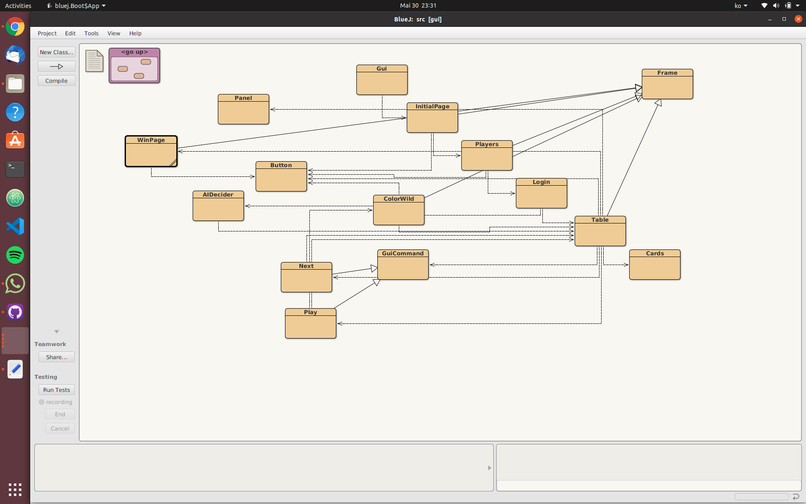

# Project PROJECTNAME

UNO (Spanish word for "One") is an American shedding-type card game that is played 
with a specially printed deck. The game's general principles put it into 
the crazy eights family of card games, and it is similar to the traditional 
European game mau-mau.


## Team Members

* Giorgio Bonetto (bonetgi@usi.ch), Bonett0
* Hun Rim (rimh@usi.ch), TKartist

## Mentor

* Tom

## Rule 

Every player views his/her cards and tries to match the card in the Discard Pile.
You have to match either by the number, color, or the symbol/Action.
For instance, if the Discard Pile has a red card that is an 8 you have to place either a red card or a card with an 8 on it.
You can also play a Wild card (which can alter current color in play).
If the player has no matches or they choose not to play any of their cards even though they might have a match,
they must draw a card from the Draw pile.
If that card can be played, play it. Otherwise, keep the card,
and the game moves on to the next person in turn.
You can also play a Wild card, or a Wild Draw Four card on your turn.

## Tui 

The text user interface of this game start asking if the user wanto to register or to login
with alresy existing credential. We have created an external text file that store the username and the password alredy encrypted so in this way we can check if the credential of the user are right or if the new player does not put one username that has been already taken.
The exist user are in the file ../src/loginINFO.txt
The Tui goes on with name table where the player can play pressing to play the card "N" and then it will be ask which cards he/she wats to play and he/she will put the position of the card. The The players can quit the game anytime by writing "Y" on the terminal.



# GUI
We follow a very similar process as the TUI. Start by pressing the start button, decide how many player wants to play and according to it, the game will open small login windows where you will have to choose whether you are an existing user or new user. Afterwards you can choose the difficulty of AI in case you don't have 4 people. When playing, you can press "next" button on top, in your turn you can click on the image of the card you want to play and it will update the screen only if the card is valid. In case of wild card user will have to choose a color from the given color palette. When there is one card you will have to press "huno" button to call huno or there will be penalties. You can always quit the game by clicking on "quit" or closing the window.



# Diagrams





## Project Structure

This project is both a Maven project and a BlueJ project.
You can open, compile, test, and run the code within BlueJ
by opening `src/package.bluej`.

You can use Maven to compile, test, and check the code
by running `mvn` in this top-level directory (see below).

You can run the code compiled by Maven from the terminal (see below).

The code is structured into three packages:

* `model` - all the model classes and their tests
* `tui` - text user interface (works in a terminal)
* `gui` - Swing-based graphical user interface (opens a window)

Note that the classes in the `model` package MUST NOT refer to any
classes in the `tui` or `gui` packages.

The classes in the `tui` package must not refer to any classes in the `gui` package.

The classes in the `gui` package must not refer to any classes in the `tui` package.

The classes in the `tui` and `gui` packages SHOULD refer to classes in the `model` package.

The classes in the `model` package need to come with unit tests.
(The classes in the `tui` and `gui` packages do not need to be covered with tests.)

## How build using Maven

In this top-level directory:

```bash
mvn compile
```

## How to run the application

To run the application from outside BlueJ, first build it with Maven.
This generates the compiled classes in the directory `target/classes`.

### Running the TUI

To run this application, with the TUI, from the command line:

```bash
java -cp target/classes tui.Tui
```

DESCRIPTION OF COMMAND LINE ARGUMENTS

### Running the GUI

To run this application, with the GUI, from the command line:

```bash
java -cp target/classes gui.Gui
```

DESCRIPTION OF COMMAND LINE ARGUMENTS

### How run the JUnit tests with Maven

```bash
mvn test
```

### How to run Checkstyle with Maven

```bash
mvn compile
mvn checkstyle:check
```

### How to run PMD with Maven

```bash
mvn compile
mvn pmd:check
```

### How to run PMD's CPD with Maven

```bash
mvn compile
mvn pmd:cpd-check
```

### How to determine test coverage with Maven

```bash
mvn site
```

Then open `target/site/index.html` and find the JaCoCo report.
